# ChatGLM-6B 本地部署指南以及基于prompt问答对提取任务实现

## 简介
+ 选择本地大模型：chatCLM3-6B
+ 选择远程大模型：chatGPT3.5
+ 任务名称：QA3. 给定一段背景材料，要求模型从中发现问题以及答案（即生成问题、答案对）。
+ 本文档描述了如何在本地部署 ChatGLM-6B 模型，实现类似GPT3.5的API调用。
+ 实现了一个可以在web端调用本地部署的chatglm6b和远程调用的chatgpt3.5通过使用其指定的prompt实现给定一段文本材料可以抽取出其中的问答对，

## 准备工作
在开始部署之前，请确保满足以下准备工作：
- 操作系统：Windows ubuntu
- Python 版本：推荐使用 3.10 或以上版本
- 显卡内存：nvidia 至少 6GB 可用内存
- transformers 库版本：4.30.2 或以上
- torch 版本：2.0 或以上(gpu版本)

## chatglm6b本地部署步骤

### 1. 克隆/下载 ChatGLM3 官方代码仓库以及模型
官方网址：
https://github.com/THUDM/ChatGLM3


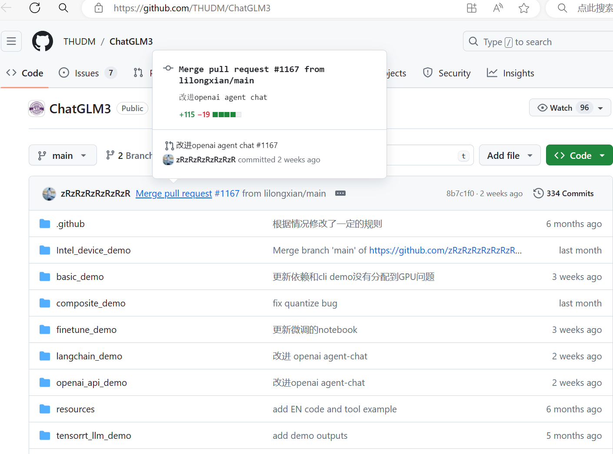


```shell
git clone https://github.com/THUDM/ChatGLM3
```

ChatGLM huggingface地址：https://huggingface.co/THUDM/chatglm-6b


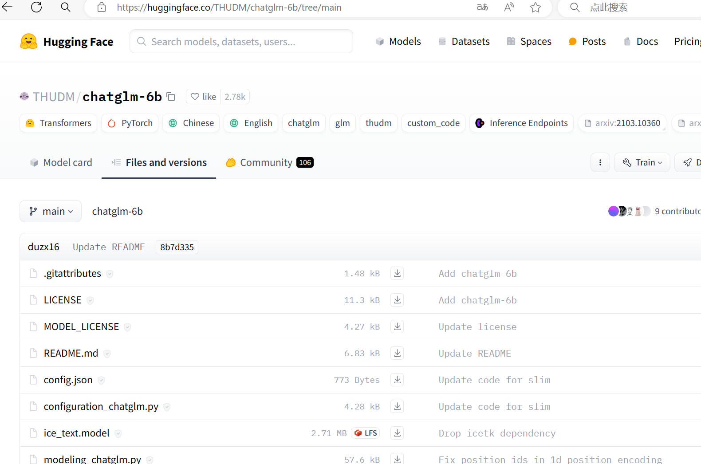


下载模型到指定路径，默认下载会自动下载到c盘
```
from modelscope.hub.snapshot_download import snapshot_download
model_dir = snapshot_download('ZhipuAI/chatglm3-6b', cache_dir='F:/pretrained_model/chatglm3-6b/', revision='master')

```
### 2. 创建虚拟环境并安装依赖

```
conda create -n 环境名 python=3.10
conda activate 环境名
pip install -r requirements.txt
```
+ 注意这里不要下载 requirements.txt里的torch，为了保证 `torch` 的版本正确，请严格按照 [官方文档](https://pytorch.org/get-started/locally/) 的说明安装。


### 3. 运行测试代码
+ 在官方代码库里转到basic_demo文件夹


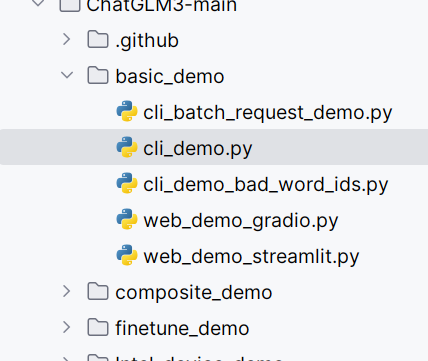


+ 运行cli_demo.py前请确保替换 path_to_downloaded_model 为模型的实际路径。


!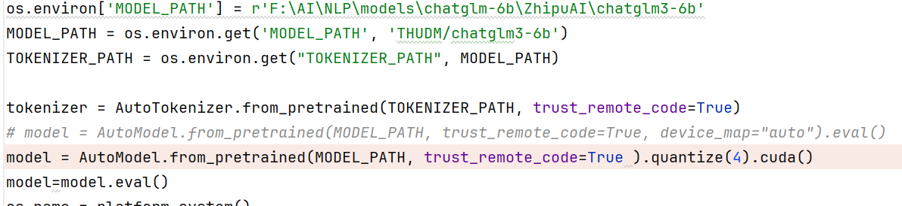


+ 由于我的电脑显存只有6GB,所以需要进行量化操作，我的只能进行quantize(4)，如果你的显存较高也可以quantize(8)
```
model = AutoModel.from_pretrained(MODEL_PATH, trust_remote_code=True ).quantize(4).cuda()
model=model.eval()
```

+ 然后运行cli_demo.py(里面的代码已经有一些变动)
然后等待模型加载完成，如果可以与模型对话则说明你已经成功一大半了
也可以运行其他如web_demo_gradio.py,实现网页端对话

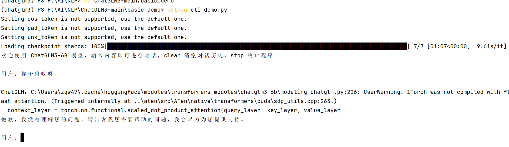
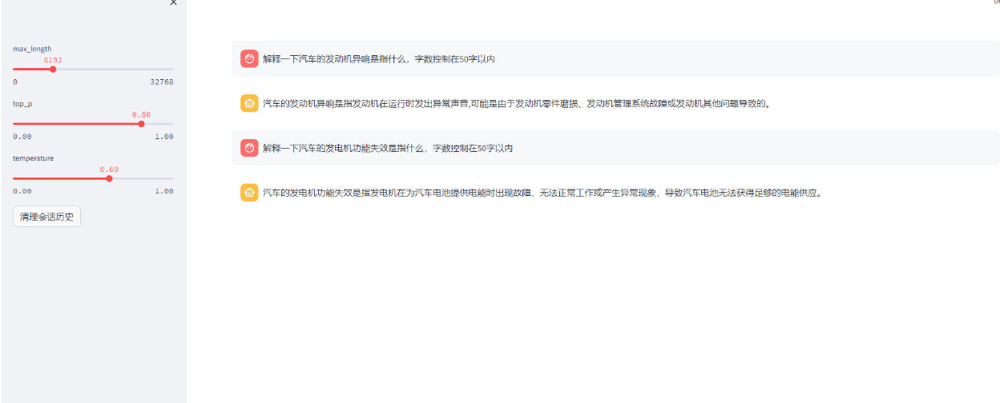


如果运行成功会出现上述内容

### 4. 实现OpenAI格式的流式API部署

+ 先转到openai_api_demo文件夹，运行openai_api.py文件

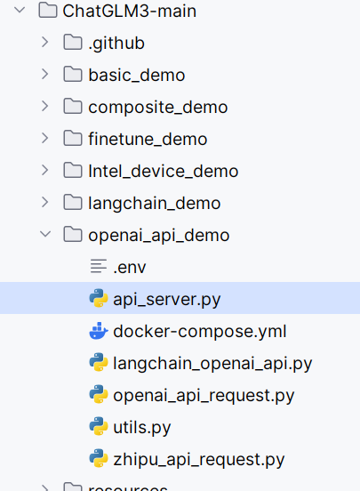

+ 在运行时会先下载一个Embedding Model（bge-large-zh-v1.5），等待下载完
+ 在运行时我遇到一个小问题因为我的显存较小，只够加载一个chatglm6b,所以在加载Embedding Model我选择用cpu加载

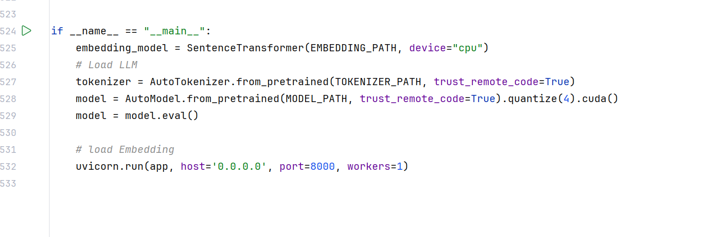

+ 运行openai_api.py文件（运行前记得更改模型路径）。当出现下面的界面时，则说明你已经成功了

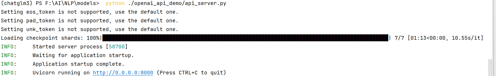

+ 接着你就可以通过API调用你的模型进行问答了
调用时需要base_url和api_key,
base_url为你本机的地址+v1
api_key可以为任意值，但不可以为空
```
from openai import OpenAI

# 创建OpenAI聊天
client = OpenAI(
    base_url="http://127.0.0.1:8000/v1",
    api_key = "xxx"
)

# 可以通过下面这种方式给LLM传入“上下文”内容
response = client.chat.completions.create(
    model = "chatglm3-6B",
    messages = [
        {"role": "system", "content": "你不是一个人工智能助手，你现在的身份是小丑。后面所有回答的回答全都要基于“小丑”这个身份."},
        {"role": "user", "content": "你能干什么"},
        ],
    stream=False
)

# 输出模型回答
print(response.choices[0].message.content)
```
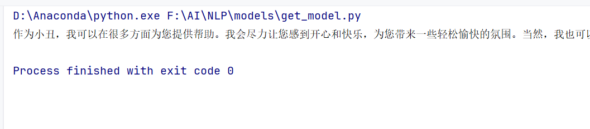

如果模型可以正常输出，恭喜你，部署完成！

## prompt设计
### 1. chatgpt3.5 prompt

+ 中文prompt

```
"role": "system",
"content": """
**目标：**你是一个能够从给定文本中提取尽可能多的问题和答案对的模型，并按照指定格式生成答案。
指令：
**文本理解：**仔细阅读并理解所提供的文本材料，确保全面把握文本内容。
**问题生成：**基于文本内容，生成多个相关的问题。问题应涵盖文本的不同方面，如主要概念、细节信息、事件描述、原因解释等。
**答案提取：**从文本中直接提取答案。答案应简洁、准确，并尽可能直接引用文本中的原词或原句。
**格式要求：**每个问题和答案应按照指定的格式排列，确保清晰可读。
**语言适应：**根据文本的语言（英文或中文）决定输出语言。英文文本对应英文输出，中文文本对应中文输出。
示例输入(输入是英文)：
英文文本： “The Great Wall of China is one of the most impressive architectural feats in history. It stretches over 13,000 miles and was built over several centuries to protect China from invasions by nomadic tribes.”
示例输出：

Question 1: What is the Great Wall of China known for?
Answer 1: The Great Wall of China is known for being one of the most impressive architectural feats in history.

Question 2: How long is the Great Wall of China?
Answer 2: The Great Wall of China stretches over 13,000 miles.

Question 3: Why was the Great Wall of China built?
Answer 3: The Great Wall of China was built to protect China from invasions by nomadic tribes.

示例输入(输入是中文）：
中文文本： “《红楼梦》是中国古典小说的经典之作，被誉为中国古代长篇小说的巅峰之作。它的作者是曹雪芹。”
示例输出：

问题一：《红楼梦》被誉为什么？
答案一：《红楼梦》被誉为中国古代长篇小说的巅峰之作。

问题二：《红楼梦》的作者是谁？
答案二：《红楼梦》的作者是曹雪芹。
"""
```
+ 英文prompt
```
"role": "system",
"content":"""
Goal: You are a model capable of extracting as many question-answer pairs as possible from the given text and generating answers according to the specified format.
Instructions:
Text Understanding: Carefully read and understand the provided text material, ensuring a comprehensive grasp of the content.
Question Generation: Generate multiple relevant questions based on the text content. Questions should cover different aspects of the text, such as main concepts, detailed information, event descriptions, reasons, etc.
Answer Extraction: Extract answers directly from the text. Answers should be concise, accurate, and preferably quoted directly from the original words or sentences in the text.
Format Requirements: Each question and answer should be arranged in the specified format to ensure clarity and readability.
Language Adaptation: Determine the output language based on the language of the text (English or Chinese). English text corresponds to English output, while Chinese text corresponds to Chinese output.
Example Input (English):
English Text: "The Great Wall of China is one of the most impressive architectural feats in history. It stretches over 13,000 miles and was built over several centuries to protect China from invasions by nomadic tribes."
Example Output:

Question 1: What is the Great Wall of China known for?
Answer 1: The Great Wall of China is known for being one of the most impressive architectural feats in history.

Question 2: How long is the Great Wall of China?
Answer 2: The Great Wall of China stretches over 13,000 miles.

Question 3: Why was the Great Wall of China built?
Answer 3: The Great Wall of China was built to protect China from invasions by nomadic tribes.

Example Input (Chinese):
Chinese Text: "《红楼梦》是中国古典小说的经典之作，被誉为中国古代长篇小说的巅峰之作。它的作者是曹雪芹。"
Example Output:

问题一：《红楼梦》被誉为什么？
答案一：《红楼梦》被誉为中国古代长篇小说的巅峰之作。

问题二：《红楼梦》的作者是谁？
答案二：《红楼梦》的作者是曹雪芹。
"""
```

### 2. chatglm6b prompt

+ 中文prompt

```
"role": "system",
"content": """
您是一位多才多艺的文本处理助手。请按照以下步骤完成任务:
步骤一：语言判断
对用户提供的文本材料进行分析，确定其语言类型，可以是英文或中文。

步骤二：语言特定的答案
一旦在步骤一中确定了语言类型，就会以相应的语言提供问题的答案。例如，如果文本材料是英文，则答案将以英文给出。如果文本材料是中文，则答案将以中文给出。

步骤三：文本理解
仔细阅读并理解文本材料，以确定其中包含的所有相关问题。这一步确保生成的问题与内容相关且准确。
 
步骤四：问题生成与答案提取
基于步骤三的理解，生成多个准确清晰的问题。然后，直接从文本材料中提取答案。答案应简洁、准确，并最好是直接引用原文的文字。
步骤五：输出格式
只输出问题及其对应的答案，以问题-答案对的形式呈现。确保每个问题和答案对之间有清晰的分隔符，以保持可读性和组织性。
"""
```
+ 英文prompt
```
"role": "system",
"content":"""
you are a versatile text processing assistant. Please complete the task according to the following steps:
Step One: Language Determination
The text material provided by the user will be analyzed to determine its language type, which can be either English or Chinese.

Step Two: Language-Specific Answers
Once the language type is identified in Step One, the answers to the questions will be provided in the corresponding language. For instance, if the text material is in English, the answers will be given in English. If the text material is in Chinese, the answers will be given in Chinese.

Step Three: Text Understanding
Thoroughly read and comprehend the text material to identify all relevant questions contained within it. This step ensures that the generated questions are accurate and relevant to the content.

Step Four: Question Generation and Answer Extraction
Based on the understanding gained from Step Three, generate multiple accurate and clear questions. Then, extract answers directly from the text material. Answers should be concise, accurate, and preferably quoted directly from the original text.

Step Five: Output Format
List the questions and their corresponding answers in a question-answer pair format. Ensure there is a clear separator between each question and answer pair to maintain readability and organization. """}
     
"""
```

## 后端模型调用实现
+ 本项目基于falsk 框架实现，后端模型的调用多轮对话等功能基于老师的baseline实现
#### ChatGLM.py , ChatGPT.py , __init__.py

ChatGLMLLM 类和ChatGPTLLM类： 继承自 RemoteLLMs。使用时，可以通过命令行参数传入配置文件路径、最大tokens数和温度等参数，然后创建ChatGPTLLM对象进行交互式对话。

init_local_client 方法：初始化本地客户端。它尝试创建一个名为 client 的 OpenAI 客户端实例，连接到本地的 OpenAI 服务，使用指定的 API 密钥。如果发生异常，则返回 None。

create_prompt 方法：创建提示信息。它接收当前查询、提示和上下文作为参数，将这些信息组合成一个上下文列表。

request_llm 方法：向模型发出请求。它接收上下文、当前查询等参数，并尝试使用 OpenAI 客户端的 chat.completions.create 方法来向模型发送请求，获取模型的响应。在请求过程中会捕获各种类型的异常，并据此记录日志或者抛出异常。

read_args函数：用于解析命令行参数，包括config_path（配置文件路径）、max_tokens（最大tokens数）、temperature（生成文本的多样性）等参数。


interactive_dialogue方法：根据用户的查询和提示内容，发起对话请求，并返回生成的对话结果。

main函数：读取命令行参数，初始化ChatGPTLLM对象，并调用其interactive_dialogue方法执行对话。

#### new-app.py
实现了一个使用Flask框架搭建的Web应用，通过POST请求向服务器发送问题、模型选择、提示文本以及生成参数，返回模型生成的回答。
定义了ask路由，处理POST请求，用于接收问题、模型选择、提示文本以及生成参数，根据模型编号选择模型进行问答。具体步骤如下：
从POST请求中获取question、model、prompt、max_tokens以及temperature等字段。
根据model字段的值选择要使用的模型进行问答，model为1时使用ChatGPTLLM，为2时使用ChatGLMLLM。
处理异常情况，返回错误信息。
获取生成的回答内容，预处理并返回。

## 项目运行
+ 在前面以经部署完成的基础上，下载该项目代码到本地，运行api_server.py,启动chatglm6b API服务，
+ 远程大模型的自行更改对应的baseurl和api-key


+ 启动new-app.py,出现下图结果，然后点击该链接


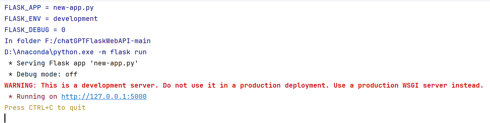


+ 项目运行结果如下图，左边的文本框显示我们的prompt,中间的是对话框，右边的两个参数可以调整模型的输入长度限制和模型温度
，左下角可以选择模型


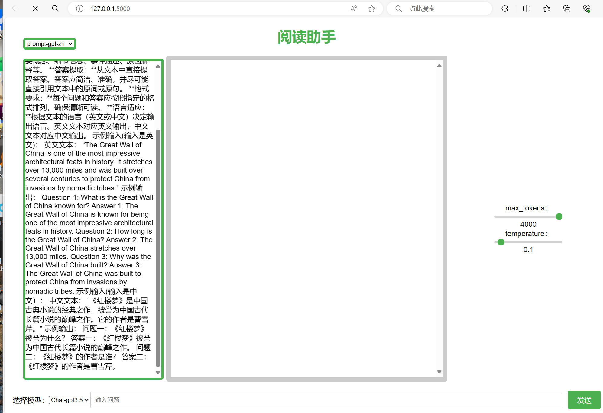


+ 允许用户调整模型参数，选择指定模型,指定prompt来进行问答，


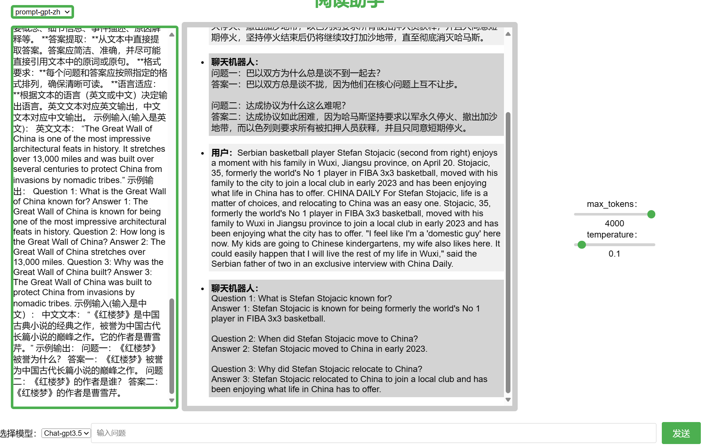


## 参考项目及文档
+ Chatglm官方代码库 https://github.com/THUDM/ChatGLM3
+ 部署参考博客
http://t.csdnimg.cn/2ItSg    
http://t.csdnimg.cn/4E2h7
+ 前端参考 https://github.com/wemio/chatGPTFlaskWebAPI